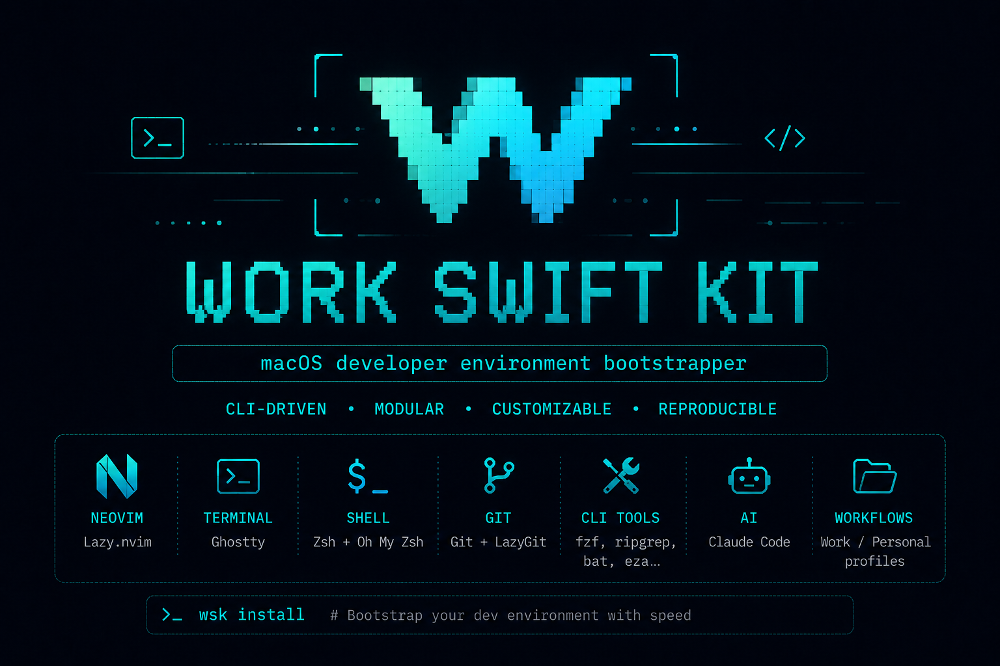

# Work-Swift-Kit

<p align="center">
  
</p>

<p align="center">
  <a href="https://github.com/Samirlb/Work-Swift-Kit/actions/workflows/ci.yml"></a>
  <a href="https://github.com/Samirlb/Work-Swift-Kit/releases/latest"></a>
  
  
  
</p>

Interactive dev environment setup for single or multi-account workflows. Configures git, SSH, zsh, Claude Code, and AI dev tools per account using GNU Stow.

Supported platforms: **macOS** and **Linux**. Windows prints setup instructions without crashing.

## Install via Homebrew

```bash
brew tap Samirlb/work-swift-kit https://github.com/Samirlb/Work-Swift-Kit
brew install work-swift-kit
```

## Install via curl

```bash
curl -fsSL https://raw.githubusercontent.com/Samirlb/Work-Swift-Kit/main/install.sh | bash
```

## Usage

Run `wsk` with no arguments to open the interactive menu:

```bash
wsk
```

Or call any action directly:

| Command          | What it does                                                                        |
| ---------------- | ----------------------------------------------------------------------------------- |
| `wsk`            | Open the interactive menu                                                           |
| `wsk setup`      | Full setup: accounts, packages, terminals, AI dev tools, gh auth, dotfiles          |
| `wsk accounts`   | Configure accounts and authentication only                                          |
| `wsk terminals`  | Install terminals/editors only                                                      |
| `wsk ai`         | Install Claude Code, AI framework, codegraph, and curated skills per account        |
| `wsk sync`       | Run `gentle-ai sync` (configs + skills) for every gentle-ai account                 |
| `wsk doctor`     | Scrollable health check of tools, links, accounts, AI setup, and SSH agent          |
| `wsk update`     | Update the kit, upgrade CLI tools, sync gentle-ai, optionally refresh dotfiles      |
| `wsk relink`     | Re-render and re-link dotfiles without re-collecting accounts                       |
| `wsk fix-claude` | One-shot fix for Claude config hygiene (remove `~/.claude` symlink / backup)        |
| `wsk fix-git`    | Convert HTTPS GitHub remotes to SSH aliases (dry-run by default; `--apply` to run)  |
| `wsk version`    | Print the current wsk version                                                       |
| `wsk help`       | Show all available commands with descriptions                                       |

### The menu

```
  Full setup           Install everything and configure all tools
  Accounts only        Configure accounts and authentication
  Terminals only       Setup shells, aliases and terminal tools
  AI dev tools         Install Claude Code, framework, codegraph and skills per account
  Check configuration  Verify installed tools, links and accounts
  Update               Pull latest kit and upgrade packages
  Re-link configs      Re-symlink existing configuration files
  Quit                 Exit the installer
```

Press **Ctrl+C** at any prompt to cancel and return to the menu. Press **Ctrl+C twice** at the return screen to exit the installer entirely.

## Account modes

At the start of any setup flow, WSK asks how many accounts to configure:

| Mode | What it sets up |
|------|----------------|
| **Single account** | One account — your choice of `work` or `personal` |
| **Work + Personal** | Two accounts in work-first order |
| **Work + Personal + more** | Two accounts plus any number of extras |

Only the accounts configured in the current session are used for AI setup and GitHub authentication. Existing `.env` files on disk are not touched unless explicitly reconfigured.

## What it sets up

- `.gitconfig` with per-account `includeIf` blocks
- `.gitconfig-{account}` per account (name, email, GitHub user, SSH command)
- `.ssh/config` with `Host github-{account}` entries per account
- A **Work-Swift-Kit block** spliced into your existing `~/.zshrc` (between `# >>> work-swift-kit >>>` markers) with PATH, pnpm, the `claude` account picker, and `work()` / `personal()` switcher functions — your own `~/.zshrc` content is never replaced
- `.gitignore_global` covering macOS, Node, Flutter, Android, iOS, Expo, secrets, editors, Claude
- Claude Code installed globally via the official installer
- Per-account AI framework: choose from `gentle-ai`, `gsd`, or `superpowers`
- `codegraph` MCP server wired into `~/.claude-{account}/.mcp.json` (optional, per account)
- Curated Claude skills in `~/.claude-{account}/skills/` (for gsd/superpowers accounts)

## Switching accounts

After setup, use these shell functions to switch between accounts:

```bash
claude            # asks which account to open (fzf), then launches Claude with its config
work              # fzf project picker → opens Claude in selected project
personal          # fzf project picker → opens Claude in selected project
work <project>    # jump directly to a project
work -p           # list available projects without opening Claude
gh-work <cmd>     # run any gh command as the work account
gh-personal <cmd> # run any gh command as the personal account
claude-work       # open Claude with work config, from wherever you are (no cd, no gh switch)
claude-personal   # open Claude with personal config, from wherever you are (no cd, no gh switch)
```

The bare `claude` command now prompts for which account to open: with a single account it launches that one directly; with two or more it shows an fzf picker; if `CLAUDE_CONFIG_DIR` is already set (e.g. inside `work`/`personal`/`claude-{account}`) it honors that and skips the prompt.

Each switcher swaps the active `gh` user, sets `CLAUDE_CONFIG_DIR` to `~/.claude-{account}`, and opens Claude in the selected project directory. Use `claude-{account}` when you want Claude's account config without switching directories or `gh` context.

## AI Dev Layer (`wsk ai`)

`wsk ai` sets up the full AI development layer and can be run standalone at any time.

### What it does

1. Detects OS and package manager
2. Installs **Node.js** and **pnpm**
3. Installs **Claude Code** globally
4. For each account, prompts to:
   - Choose an **AI framework**: `gentle-ai`, `gsd`, or `superpowers`
   - Optionally install **codegraph** and wire its MCP config
   - Install **curated Claude skills**

### Framework choices

| Framework | Description |
|-----------|-------------|
| `gentle-ai` | Installed via Homebrew tap `Gentleman-Programming/homebrew-tap`. CLAUDE.md is owned by gentle-ai and excluded from stow. WSK temporarily renames `~/.claude-{account}` to `~/.claude` during install to satisfy gentle-ai's symlink checks, then restores it. After install (and on `wsk sync` / `wsk update`) WSK runs `gentle-ai sync` per account to pull the latest managed configs and skills. |
| `gsd` | Installed via `npx get-shit-done-cc --global`; falls back to git clone if npx fails. |
| `superpowers` | Cloned into `~/.claude-{account}/superpowers`; activate with `/plugin install` inside Claude. |

Re-running `wsk ai` is idempotent — existing framework choices are preserved.

### Keeping gentle-ai in sync

`gentle-ai` ships frequent updates to its agent configs and skills. To keep every gentle-ai account current:

- **New installs** — `wsk ai` / `wsk setup` run `gentle-ai install` followed by `gentle-ai sync` per account automatically.
- **Existing installs** — run `wsk sync` to `gentle-ai sync` all gentle-ai accounts, or `wsk update` (which also runs `gentle-ai upgrade` to refresh the managed tool binaries first).

Each sync is scoped to the account's `~/.claude-{account}` dir using the same temporary `~/.claude` swap as install, since gentle-ai only operates on `~/.claude` and refuses symlinks.

### Curated skills

For `gsd` and `superpowers` accounts, 6 skills are cloned from `Gentleman-Programming/gentle-ai`:
`branch-pr`, `chained-pr`, `work-unit-commits`, `comment-writer`, `issue-creation`, `judgment-day`.

## GitHub auth

- Runs in **work → personal** order
- Skips already-authenticated accounts
- Requests `admin:public_key` scope so SSH key validation works without extra steps
- After auth, checks if the SSH public key is already on GitHub via `gh ssh-key list`; uploads only if missing

## Dependencies

### Bootstrap (installed automatically)

| Tool | Purpose |
|------|---------|
| `gum` | Interactive TUI (menus, spinners, prompts) |
| `stow` | Dotfile symlinking |
| `fzf` | Fuzzy project picker |
| `gettext` | Template rendering (`envsubst`) |

### Base packages

`git`, `gh`, `fzf`, `ripgrep`, `bat`, `eza`, `fd`, `sd`, `starship`, `zoxide`, `jq`, `tree`

### AI dev layer

| Tool | Purpose |
|------|---------|
| `node` | JavaScript runtime |
| `pnpm` | Package manager |
| `claude` | Claude Code CLI |
| `codegraph` | Codebase MCP server (optional, per account) |

## `wsk fix-claude`

One-shot remediation for Claude config hygiene. Removes or backs up `~/.claude` when
per-account `~/.claude-{acct}` directories are present (prevents double-loading of
CLAUDE.md and skills via ancestor traversal). For `gentle-ai` accounts, also copies
`RTK.md` from sibling dirs and re-injects the Sub-Agent Context Minimalism block into
`CLAUDE.md`. Idempotent — safe to run more than once.

See [docs/claude-config-hygiene.md](docs/claude-config-hygiene.md) for full details.

## `wsk fix-git`

Scans your projects directory and converts HTTPS GitHub remotes to SSH aliases.

```bash
wsk fix-git          # preview changes (dry-run, no writes)
wsk fix-git --apply  # apply the conversions
```

A repo at `https://github.com/org/repo.git` with a `work` account becomes
`git@github-work:org/repo.git`, so pushes and pulls use the account's SSH key and
correct `gh` identity automatically.

## Per-account git identity model

Each account gets its own SSH alias, gitconfig, and `gh` session:

| Piece | What it does |
|-------|-------------|
| `~/.ssh/config` `Host github-{acct}` | Routes SSH to the account's key |
| `~/.gitconfig-{acct}` | Stores `user.name`, `user.email`, `core.sshCommand` |
| `~/.gitconfig` `includeIf` | Activates the right gitconfig per projects directory |
| `gh auth switch` | Swaps the active `gh` session to the account |
| `_wsk_gh_switch` | Injected into `claude-{acct}` / `gh-{acct}` wrappers to auto-switch `gh` context |

**HTTPS remote pitfall:** git operations on repos with `https://github.com` remotes
use whichever `gh` account is active at the time, not the account tied to the directory.
Run `wsk fix-git --apply` to convert HTTPS remotes to the correct SSH alias, or `wsk doctor`
to find any remaining HTTPS remotes.

## `wsk doctor`

Scrollable health check (`↑↓` to scroll, `q` to return to menu). Reports on:

| Section | Checks |
|---------|--------|
| Dependencies | `brew`, `gum`, `stow`, `fzf`, `gettext` and base packages |
| OS / Package manager | Detected OS and package manager |
| Node / pnpm / Claude Code | Runtime and CLI availability |
| Claude productivity tools | `rtk` hook, caveman plugin per account |
| Claude config hygiene | `~/.claude` ancestor-traversal risk, CLAUDE.md markers |
| AI frameworks | Framework installed per account |
| Skills | Required skills present per account |
| Dotfile links | `.gitconfig`, `.gitignore_global`, `.zshrc` block, `.ssh/config` |
| Accounts | Per-account gitconfig, CLAUDE.md, SSH key file |
| SSH agent | Key loaded in agent per account; `--apple-use-keychain` fix hint on macOS |
| GitHub auth | `gh` login and active account per account |
| git / gh identity | Active `gh` account, HTTPS remote detection, SSH alias/directory mismatch |

To enable optional SSH connectivity checks (tests `git@github-{acct}` with a 5-second
timeout), set `WSK_SSH_CHECK=1` before running `wsk doctor`.

## Re-running

All install steps are idempotent. `gentle-ai` accounts skip CLAUDE.md in stow (gentle-ai owns that file). Conflicting real files are backed up as `{file}.bak.YYYYMMDD-HHMMSS` before stow runs.

## Troubleshooting

### Permission denied (publickey)

```
git@github-work: Permission denied (publickey).
```

**Why it happens:** The SSH key for the account exists but its passphrase is not loaded
in the SSH agent. Non-interactive contexts (background git operations, Claude Code tool
calls) cannot prompt for a passphrase.

**One-time fix:**

```bash
# macOS — stores the passphrase in Keychain so it's available after reboot
ssh-add --apple-use-keychain ~/.ssh/id_ed25519_work

# Linux — loads into the running agent for this session
ssh-add ~/.ssh/id_ed25519_work
```

New setups do this automatically: WSK calls `_ssh_add_key` immediately after
generating each ed25519 key, so the passphrase is loaded into the agent the moment
it's typed.

**Verify it worked:**

```bash
ssh -T git@github-work   # expect: "Hi <user>! You've successfully authenticated"
```

`wsk doctor` also reports whether each account's key is loaded in the agent and
shows the exact `ssh-add` command if it is not.

### CLAUDE.md loaded twice / skills appear twice

`~/.claude` exists alongside `~/.claude-{acct}` directories — Claude Code loads both
via ancestor-directory traversal. Run `wsk fix-claude` to remove the stale `~/.claude`.

See [docs/claude-config-hygiene.md](docs/claude-config-hygiene.md) for the full explanation.

### HTTPS remote using the wrong account

A repo cloned via HTTPS (`https://github.com/org/repo`) uses whichever `gh` session
is active, not the account tied to the projects directory. Convert it:

```bash
wsk fix-git          # preview which remotes would change
wsk fix-git --apply  # apply
```

## Development

```bash
brew install bats-core shellcheck
bats tests/e2e/
shellcheck lib/*.sh templates/*.sh install.sh
```

CI runs on `macos-latest` and `ubuntu-latest` using PATH shims for external tools.
